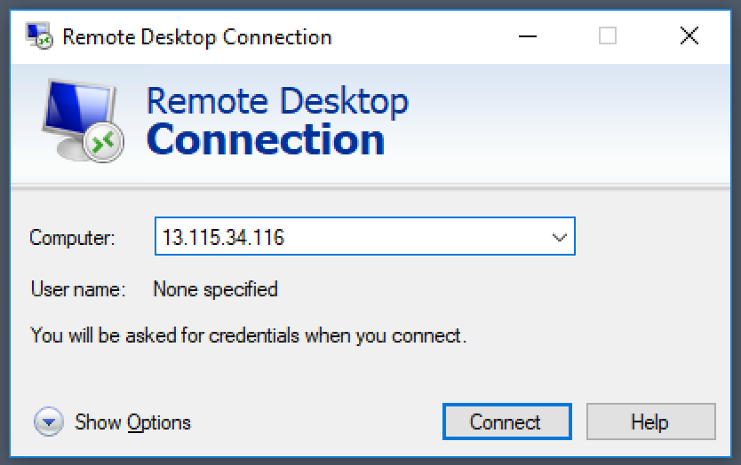
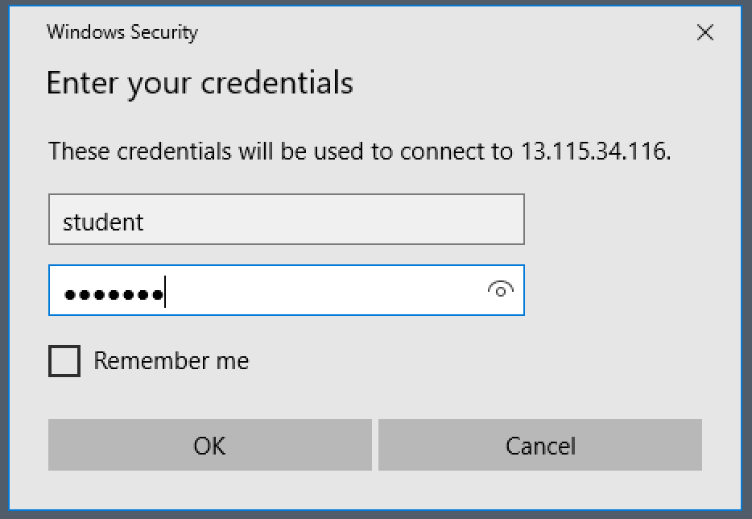
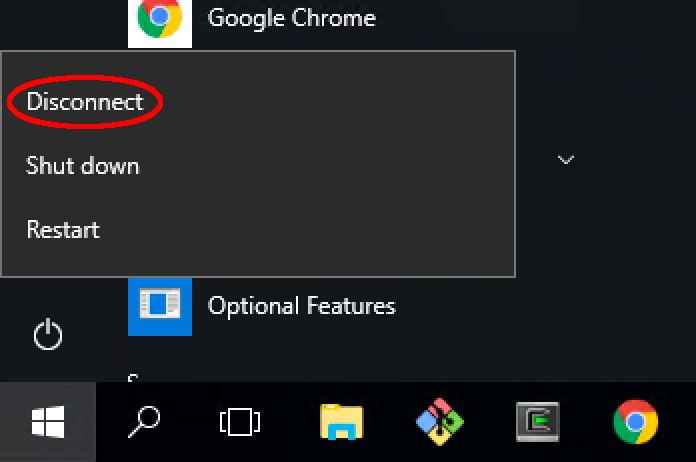

# Class Preparation Instructions

These instructions describe the steps to prepare for the 
xtUML training class.   

* [Virtual Machine](#1.)
  * [Log in](#1.1.)
  * [Start BridgePoint](#1.2.)
  * [Disconnect](#1.3.)

##  1. Virtual Machine 

###  1.1. Log in
The instructions to connect and log in here are the basic steps.  To set up
a shared folder from the local machine while logging in, [follow these instructions](connect_shared_folders.html).  

* Launch __Remote Desktop Connection__   
{:height="703" width="401"}  
* Enter one of the available IP Addresses: __54.92.46.225__   
{:height="524" width="834"}  
* Enter login info (user, password): student, Robots1   
{:height="644" width="934"}  
* Click "Yes" to the Certificate Warning dialog   
* Windows desktop is shown   

###  1.2. Start BridgePoint
* Start BridgePoint using the desktop shortcut   
{:height="804" width="152"}
* Test usability, play with the Welcome > Quick Start > Microwave Oven example  
* Exit BridgePoint  

###  1.3. Disconnect
* To exit the session, use Start > Power > Disconnect.  __Do not use Shut down__  
{:height="492" width="696"}

## Congratulations!

You have completed your virtual machine class preparations.
