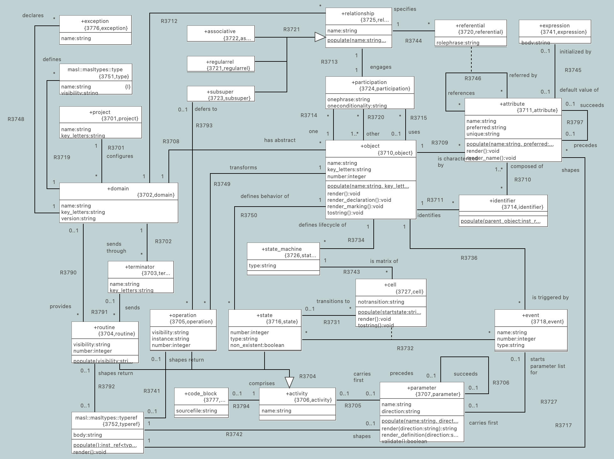
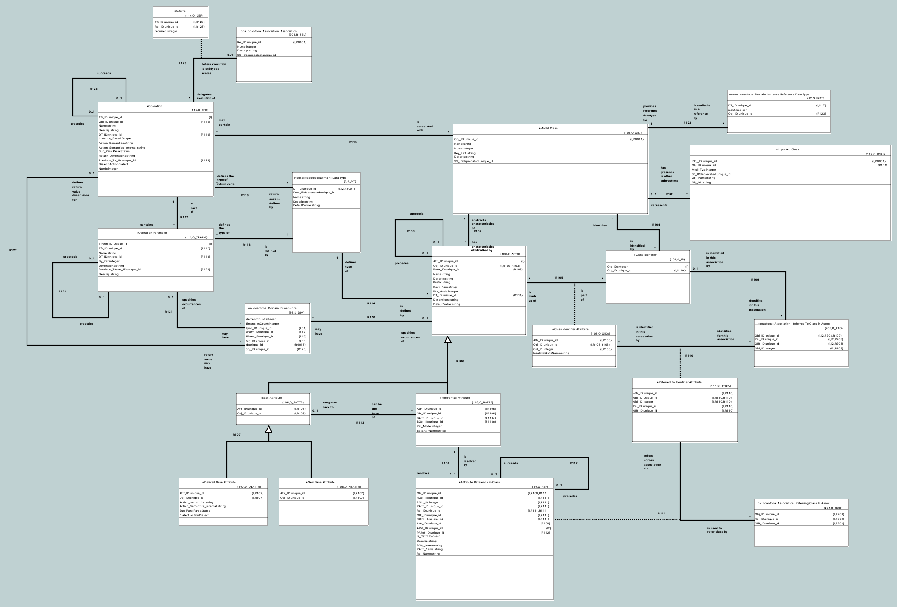
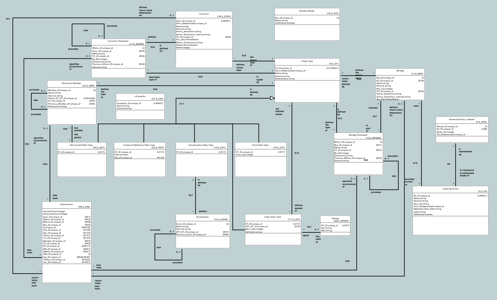
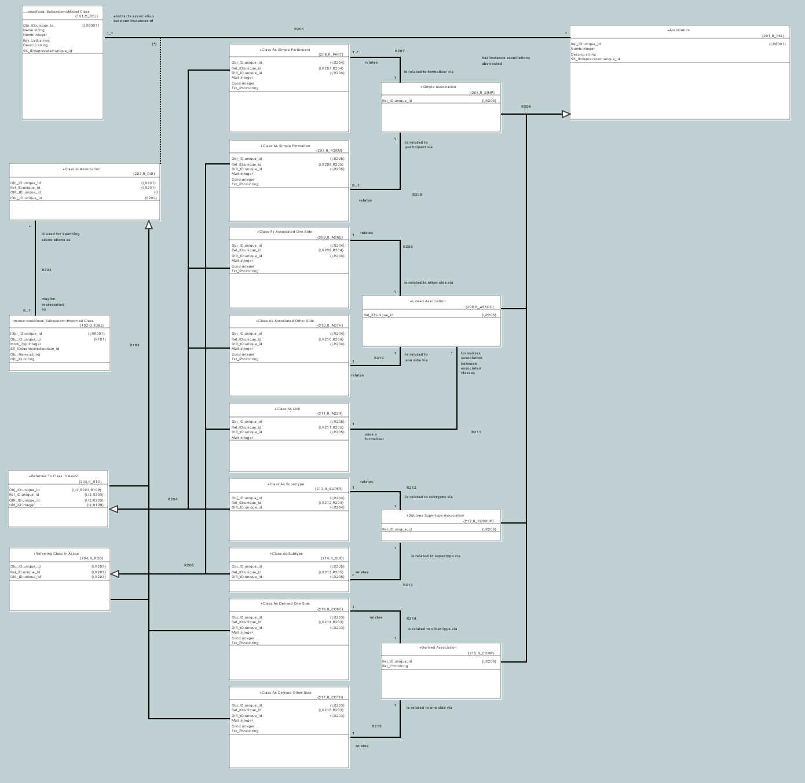
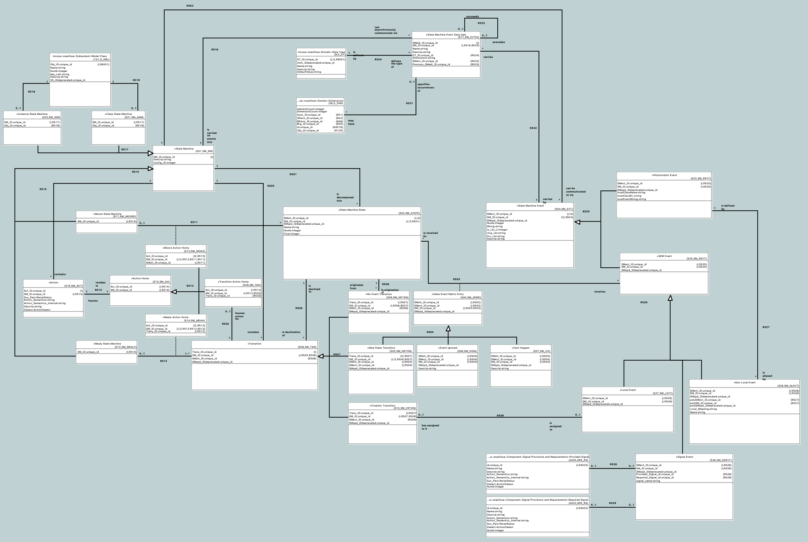
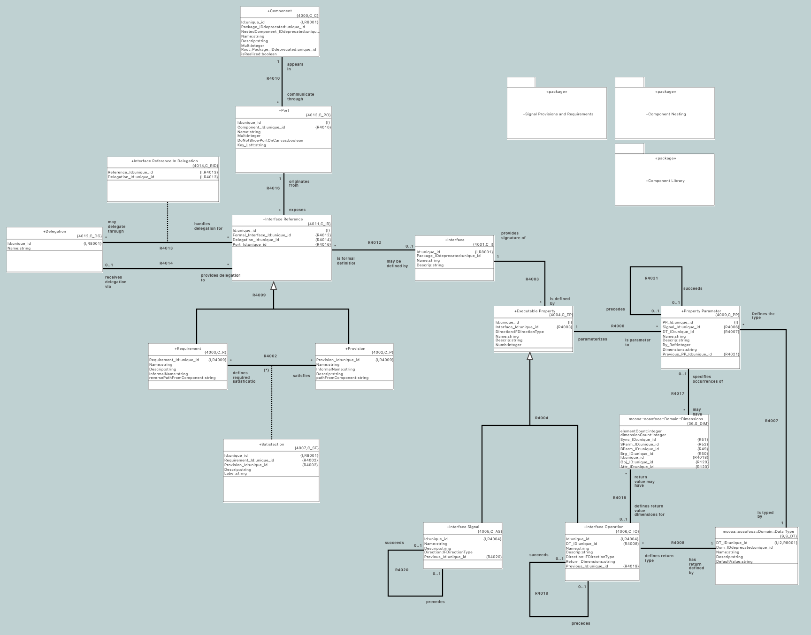
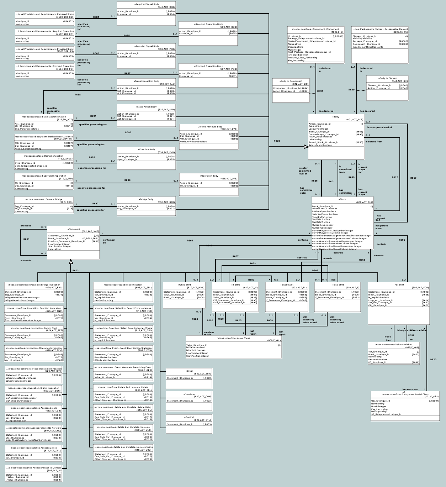
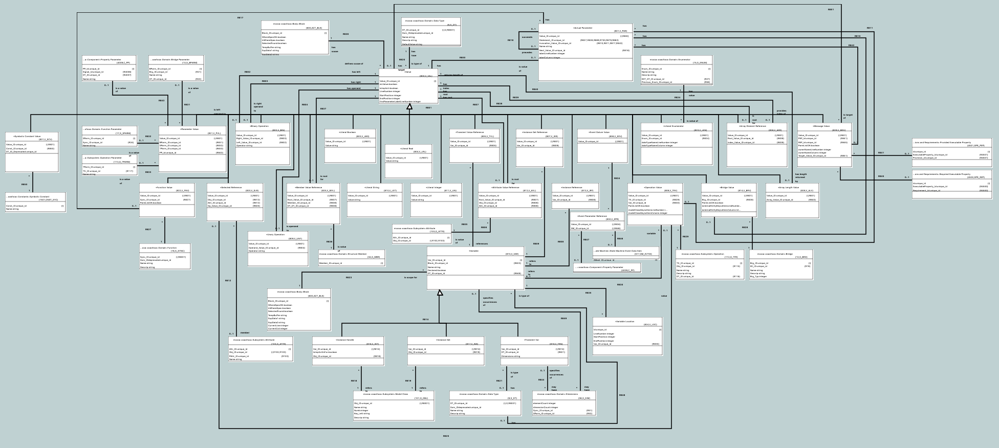

= Some Meta-Models

== Simplified Model of MASL

This is a simple yet useful S-M MM.

[link=masl.pdf]

== BridgePoint xtUML Meta-Model

The BridgePoint MM is core to the editor, Verifier (simulator) and the model compilers.

=== Subsystem

[link=subsystem.pdf]

=== Domain

[link=domain.pdf]

=== Association

[link=association.pdf]

=== State Machine

[link=state_machine.pdf]

=== Component

[link=component.pdf]

=== Action Language

==== Statement

[link=statement.pdf]

==== Expression

[link=expression.pdf]

