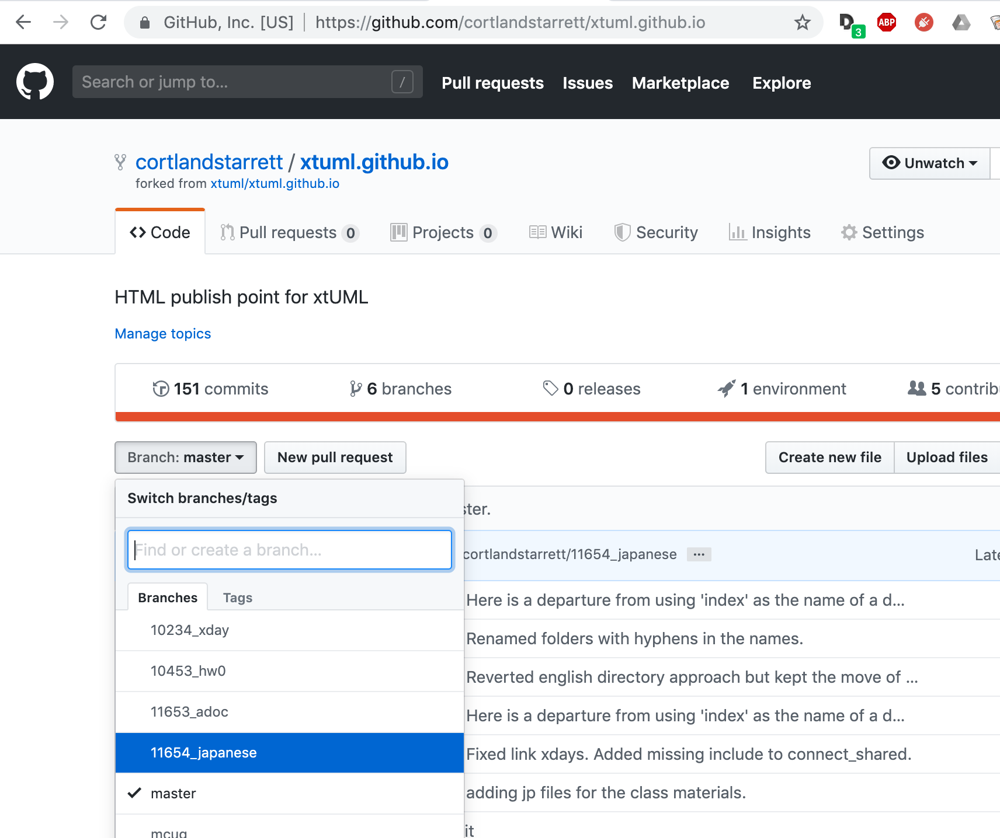
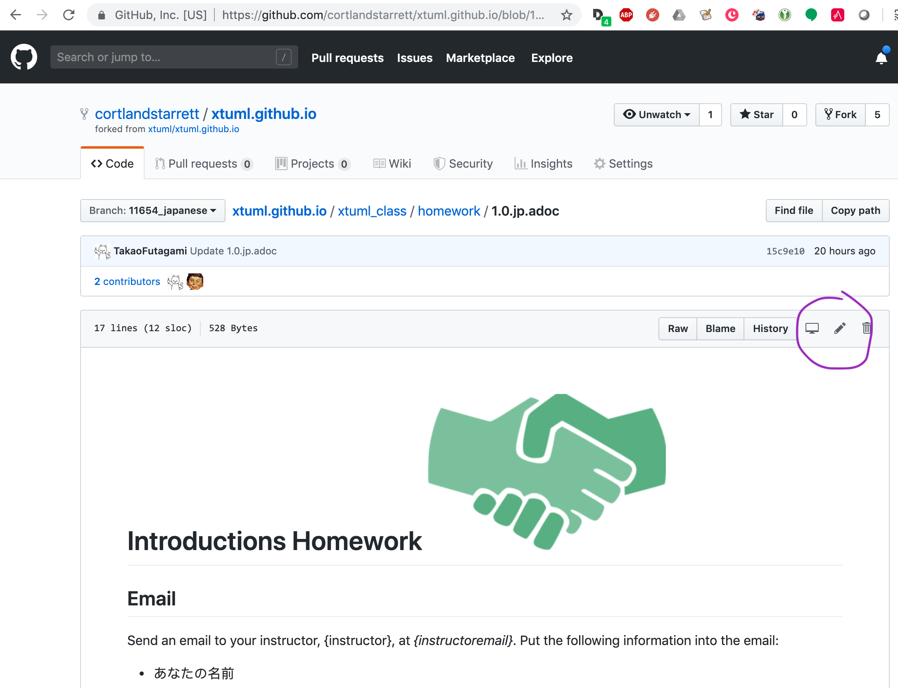
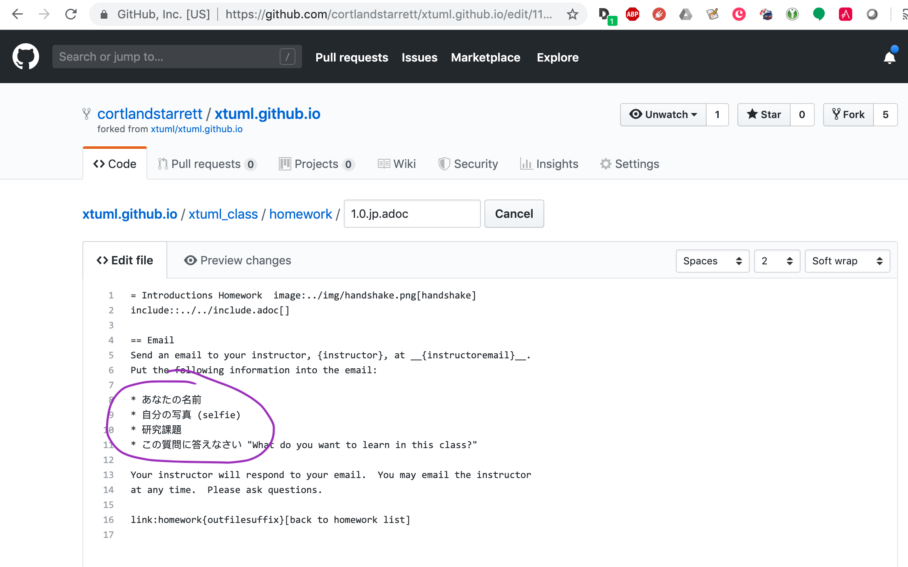

= Translation
include::../include.adoc[]

== How To Translate Documents

. Visit https://github.com/cortlandstarrett/xtuml.github.io[fork of class materials repository].

. Be sure you are on the `<> Code` tab.
+

. In the 'Branch' selection list, choose the '11654_japanese' branch.

. Navigate to the '???.jp.adoc' file that you wish to translate, for example
  `homework/1.0.jp.adoc`.
+

. Click on the "pencil" icon to 'Edit this file'.
+

. Edit the English that you wish to be translated into Japanese.  When done
  editing, 'Commit' (green button at bottom) the change.  It will be merged
  by the administrator of the repository.
