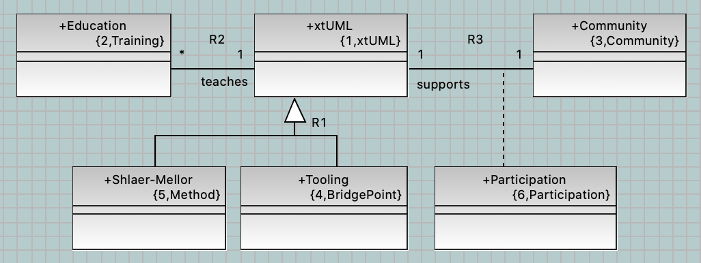

= Shlaer-Mellor Day 2023
include::../include.adoc[]

**14 November 2023 (half-day Tuesday afternoon UK time)**

__Previously known as:__  **xtUML Day**

<<Agenda of Presentations>> | <<Registration>> | <<Important Dates>> | 
https://www.paypal.com/cgi-bin/webscr?cmd=_s-xclick&hosted_button_id=2P3UUJP9KHUD2[**Pay for Shlaer-Mellor Day**]

== What is this?

*Shlaer-Mellor Day 2023* is a modeling conference and represents the 10th
edition of Shlaer-Mellor Day (also xtUML Day).  (See <<Previous Shlaer-Mellor Days>>.)
Shlaer-Mellor Day is the premier gathering of the year of Shlaer-Mellor modelers.
The Shlaer-Mellor xtUML Community meets to collaborate on Modeling, Method and Tooling.

The central topic of the conference is end-to-end modeling, execution,
translation and deployment of models-as-code in mission critical settings
employing rigorous methodology.  The unifying theme is practical, actual,
industrial application modeling within production installations.
Attendees will network with engineers, scientists and educators who
understand executable and translatable modeling as applied in active
systems.

In 2023 continued attention is paid to extending and clarifying the
__Shlaer-Mellor Method__ in light of undocumented developments over the
last several years.

Also in focus:

* Method advances
* Tooling Refinements  
* Incremental Adoption
* Model Compilation

The Shlaer-Mellor Community is keen to exchange expertise and learn from one
another.  Shlaer-Mellor Day provides a forum for developers to share best
practices and influence the direction of the technology.  The conference committee
hereby solicits compelling papers and presentations that exhibit method
advances, tooling improvements and application experience in Shlaer-Mellor
modeling and related Executable/Translatable modeling.

=== Conference Format and Venue

Shlaer-Mellor Day is an information dense and interactive conference
lasting 4 hours.  Presentations with Q&A and discussions will
fill the session.  Shlaer-Mellor Community members will give updates on
their applications and experiences.  An open moderated discussion time
ends the day.

Shlaer-Mellor Day 2023 will be hosted on https://zoom.us/[*Zoom*].  This
platform is familiar to most and supports interaction with people as well
as access to presentations.

Technical sessions are pre-recorded videos, ensuring high-density,
fast-paced information transfer while allowing the speakers to interact
with the audience as the video plays.

=== Registration

Register by emailing the co-chair (cortland.starrett at onefact.net).
Provide name and company/school information.  Do this even if you pay
through the electronic portal.

You can pay the registration fee by clicking 
https://www.paypal.com/cgi-bin/webscr?cmd=_s-xclick&hosted_button_id=2P3UUJP9KHUD2[*here*].
The link will take you to PayPal to purchase your ticket.  Price is $100.
You do not need a PayPay account to register; a credit card or debit card
is acceptable.

Payment can be made by check.  Other methods of payment can be arranged
through the conference organizers.  Discounts may be available to
companies sending more than 3 participants; contact the chair.

Scholarships may be available to university students.  Contact the
conference committee via email.

Participants under contract with the One Fact Community Engagement support
option attend at no cost.

//=== https://xtuml.github.io/xday/smdays2023.html[**Pay for Shlaer-Mellor Day 2023 here TODO COMING SOON.**]

=== Agenda of Presentations

include::smdays2023agenda.adoc[Agenda]

=== In-Person Gatherings

A dinner gathering is planned in the UK in Cheltenham on the evening of
13 November 2023.  The venue is The Ivy.  Dinner is included in the
conference registration (including a significant other).

A dinner gathering is planned in Linköping, Sweden on the evening of
15 November 2023.  The venue and time are TODO.

== Call for Papers (closed)

If you wish to be a presenter, please submit topic, title and an abstract
to the conference committee who will review and make selections.
Selection is based upon perceived value to the Shlaer-Mellor Community.
Presentations will need to be pre-recorded ahead of conference day.

Topics of interest to Shlaer-Mellor Day include but are not limited to the following:  

* real-world application modeling examples of installed systems  
* techniques of editing, verifying, translating, debugging and deploying models  
* methodology (Shlaer-Mellor) advances, extensions and refinements  
* static analysis of models and generated code  
* model-based model compilers  
* model integrity  
* action language dialects  
* target software architectures and translation onto those architectures  
* process integration of modeling and modeling tools  
* tooling supporting the Shlaer-Mellor Method  
* current state of the art editing, verification, translation, debugging  
* recent experience with tooling and BridgePoint in particular  
* techniques for educating modelers from young children to experienced professionals  
* tooling migration experience reports  

Presentations are expected to be 10-30 minutes in duration with additional
time for questions and discussion.

All submissions will be evaluated by the program committee.  
Selection is based upon significance, clarity and alignment with the call
and value to the attendees of Shlaer-Mellor Day.  Submissions
that promote discussion, advance the Method and generate interaction among
Shlaer-Mellor Community members are most desired.  For a presentation to be
accepted, at least one of the authors must register for Shlaer-Mellor Day,
present the material and participate in the conference.

== Important Dates  

* Title, session type and duration (estimate) submission:  9 September 2023
* Abstract submission deadline:  16 September 2023
* Author notification:  30 September
* Submission deadline for video recording of presentation:  3 November 2023
* Completion of production editing (jointly by presenter and committee) of presentation-ready version:  10 November 2023
* Shlaer-Mellor Day conference day:  14 November 2023 1:00-5:00pm UK time

== Conference Committee Contacts

* Michael Lee, Conference Co-Chair, Model Integration, mike [at] modelint.com
* Cortland Starrett, Conference Co-Chair, One Fact, cortland.starrett [at] onefact.net
* John Wolfe, Conference Committee Member, Maile Technical, johnwolfe [at] mailetechnical.com

If you have questions about Shlaer-Mellor Day, contact any of the above.

=== Example Presentation Videos

The following example videos are provided to encourage creativity in production.

* https://youtu.be/fac8vV5Lu3w[Models Behind the Wheel - Leon Starr]
* https://youtu.be/9F_F49MyMSo[xtUML Days 2021 - Levi Starrett: Persistent Shlaer-Mellor Models]
* https://www.youtube.com/watch?v=ygrcs4ATuMc[Populating Roadway Models -John Wolfe and Alasdar Mullarney - Shlaer-Mellor Day 2022]
* https://youtu.be/VsVmk5nyUog[Relationship Formalization and Referential Attributes - 2022]

.Bristol, UK

=== Previous Shlaer-Mellor Days

* https://xtuml.github.io/xday/smdays2022.html[xtUML Day 2022 (Zoom), 18 October 2022]
* https://chrysalis-triangle-s9cb.squarespace.com/xtuml2021[xtUML Day 2021, (Zoom), 27 October 2021]
* https://xtuml.github.io/xday/xday2020.html[xtUML Day 2020 UK (and Zoom), 5 November 2020, Portsmouth, UK]
* https://xtuml.github.io/xday/xday2019.html[xtUML Days 2019 Cheltenham, 12, 13 September 2019, Cheltenham, UK]
* https://xtuml.org/xtuml-days-2018-copenhagen/[xtUML Days 2018 Copenhagen, 15, 16 October 2018, Copenhagen, Denmark]
* https://xtuml.org/xtuml-day-2017-linkoping/[xtUML Day 2017 Linköping, 2 October 2017, Linköping, Sweden]
* https://xtuml.org/presos-from-xtuml-day-cheltenham/[xtUML Day 2017 Cheltenham, 14 March 2017, Cheltenham, UK]
* https://xtuml.org/xtumldayemd/[xtUML Day 2016, 14 May 2016, Linköping, Sweden]
* https://xtuml.org/announcing-xtuml-2015/[xtUML Day 2015, 14 December 2015, Lafayette, Indiana, USA]

=== https://www.paypal.com/cgi-bin/webscr?cmd=_s-xclick&hosted_button_id=2P3UUJP9KHUD2[**Pay for Shlaer-Mellor Day 2023 here.**]

image::einstein_classes.png[xtUML Class Diagram]

//include::smdays2023instructions.adoc[Last Minute Instructions]

////

registered attendees:

Colin Carter
Paul Francis
Greg Arnot
Levi Starrett
Cortland Starrett
Keith Brown
Robert Mulvey
John Wolfe
Alasdar Mullarney
Mike Lee
Leon Starr
Takao Futagami
Kenji Hisazumi
Hiroshi Ota
Filip Fur
Dave S
Tristan P
David Skinner <david.n.skinner@baesystems.com>
Annie Allan <annie.allan@baesystems.com>
Paul Watkins <paul.watkins4@baesystems.com>
Ollie Green <ollie.green3@baesystems.com>
Harry Carruthers <harry.carruthers@baesystems.com>
Andy Dennis <andrew.dennis@baesystems.com>
Alexis Lamas <alamas@enverasystems.com>
Jim Vaught <jvaught@enverasystems.com>
Lee Riemenschneider
Rob Day

Cheltenham dinner

Levi Starrett (Courtney)
Cortland Starrett (Roxanna)
Colin Carter
Paul Francis
Greg A (Jeanette)
Tristan Pye
David Skinner
Dave S
John T (maybe late)

Linkoping dinner

Bengt Kvarnstrom
Nils Paulsson
Per Linden
Erik Wedin
Cortland Starrett (Roxanna)
Filip Fur
Rob Day
Pontus?
Per?
Anders?
JohnT?

////
