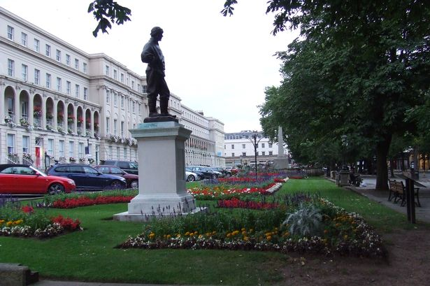

= xtUML Days 2020 UK
include::../include.adoc[]

** November 2020**

<<What is this?>> | <<Call for Papers>> | <<Important Dates>> | <<Conference Organization>>

== timely information for those attending the conference...

=== notice as of 3 September 2019

xtUML Days is next week!  The conference promises to be everything hoped.
The line-up of presentations is compelling.  However, the most exciting
aspect of the conference is the rich list of attendees from 15 different
companies and universities represented from 4 continents with the
strongest contingent coming from the UK.

This note contains critical information for your planning.  All of it can
be found on the information page (linked below) which is being kept
updated.

1. If you have not paid your registration fee, please do so.  Alert me to
any difficulties.  The PayPal portal accepts general credit cards.
2. Dinner on Wednesday 11 September begins at 7:00pm at Bill's Cheltenham
Restaurant (included in registration).  The restaurant has an online
ordering system.  You will receive notification; please order ahead of
time.  Coordinate through me if you prefer to avoid the online portal.
3. The doors open to the conference 12 September at 8:00am at The Queens
Hotel.  The presentations will begin sharply at 9:00am.  Plan to arrive by
at least 8:30 to receive a name badge and folder of materials.
4. Speakers please provide PDF or PowerPoint to me ahead of time.  If
using your own PC, please arrive by 8:15 to test it with the projector.
5. Morning snacks, lunch and an afternoon break on conference day are
catered at the venue.  The lunch menu will include salad and 2 choices of
main dish: salmon or vegetarian curry.

== What is this?

*xtUML Days 2019 UK* is a modeling conference and represents the 6th
edition of xtUML Days.  (See <<Previous xtUML Days>>.)
xtUML Days is the most dense gathering of Shlaer-Mellor modelers of the year.
The xtUML Community meets to collaborate on Modeling, Method and Tooling.

The central topic of the conference is end-to-end modeling, execution,
translation and deployment of models-as-code in mission critical settings
employing rigorous methodology.  The unifying theme is practical, actual,
industrial application modeling within production installations.
Attendees will network with engineers, scientists and educators who
understand executable and translatable modeling as applied in active
systems.  In 2019, a special focus will be applied to extending and
clarifying the Shlaer-Mellor Method in light of undocumented developments
over the last several years.

The Shlaer-Mellor Method is applied in varying degrees of integrity in
organizations around the world.  At xtUML Days people from organizations
focused on aeronautics, distributed network asset management, medical devices
and heavy factory automation among others will discuss:  

* Method advances (specifically convergence of PT and K-C dialects)  
* Standardized Architecture environments such as ECOA, FACE, AUTOSAR and
  safety standards such as ISO 26262 and IEC 60601
* Model of Communication
* Constraint Modeling
* Cryptographic Architecture
* Tooling Refinements  

The xtUML Community is keen to exchange expertise and learn from one
another.  xtUML Days provides a forum for developers to share best
practices and influence the direction of the technology.  xtUML Days
hereby solicits compelling papers and presentations that exhibit method
advances, tooling improvements and application experience in Shlaer-Mellor
modeling and related Executable/Translatable modeling.
This year attendees represent One Fact, UK Crown, BAE Systems, ROGO,
Northrop Grumman, Aurora Consulting, Software Improvements, L3, Thales,
Toyo Corporation, ICS, FrogOOA, Kyushu University, University of Southampton
and Jönköping University.

=== Keynote Speaker

The xtUML Days 2019 UK keynote speaker is Takao Futagami.  He is a chief
consultant at Toyo Corporation.  His research interests focus on embedded
systems engineering.  Futagami-sensei holds a degree in physics from Tsukuba
University and is a professor at Tokai University.

Mr. Futagami was instrumental to the introduction of the Shlaer-Mellor Method,
xtUML and associated tooling into Japan in the 1990s and continues to promote
modeling in industry and education.  Futagami has helped translate much of the
Shlaer-Mellor literature into Japanese.

Shlaer-Mellor Material:

* _Executable UML: A Foundation for Model-Driven Architecture_, Stephen Mellor and Marc Balcer
* _MDA Distilled_, Stephen Mellor and Kendall Scott
* _How to Build Shlaer-Mellor Object Models_, Leon Starr
* _Executable UML How to Build Class Models_, Leon Starr

Programming and C:

* _Programing LEGO Mindstorms_, Brian Bagnall
* _MISRA-C Coding Guideline 1997_
* _MISRA-C Coding Guideline 2004_

=== Venue

xtUML Days 2019 UK will be hosted at https://www.queenshotelcheltenham.co.uk/[Queens Cheltenham].

=== Registration

Register by emailing the chair (cortland.starrett at onefact.net).  Provide
name and company information.

Registration is $500 (USD) for participants not under contract with the
Community Engagement option.  Payment can be made by check.  Payment can
be made with a credit card (through PayPal below).  Other methods of payment
can be arranged through the conference organizers.  Discounts are offered
to companies sending more than 3 participants; contact the chair.

https://www.paypal.com/cgi-bin/webscr?cmd=_s-xclick&hosted_button_id=4DSSVJ5GWN324[**Pay for xtUML Days 2019 UK here.**]

=== Agenda of Presentations

Thursday 12 Sep (Conference Day)

* 08:00 room open, coffee, meet and greet
* 09:00 (sharp) Welcome, Introductions and Logistics (Cort) (0.25)
* 09:15 keynote _Shlaer-Mellor in Japan_ (Toyo Corporation, Takao Futagami) (0.75)
* 10:00 _xtUML in the Field:  Robotic Soil Sampling_ (ROGO, Levi Starrett) (0.75)
* 10:45-11:15 <break>
* 11:15 _Formal Modeling and UML-B_ (U of Southampton, Colin Snook) (0.75)
* 12:00 OOA '20 Overview and Method Debate (One Fact - Levi) (0.5)
* 12:30-13:30 lunch (catered)
* 13:30 _Modeling Communications_ (Tower - Tristan) (0.75)
* 14:15 _Waterloo AutoCoder Architecture_ (BAE - Ashley Field) (0.75)
* 14:45 Architectures - Panel Discussion (ColinC, Tristan, Ashley) (Rob) (0.5)
* 15:30-15:45 <break>
* 15:45 _Modeling Education in Japan_ (Kyushu U - Kenji Hisazumi) (0.75)
* 16:30 _Shlaer-Mellor Runtime w/ Cryptographic Extensions_ (One Fact - Cort) (0.75)
* 17:15 closing discussion
* 17:30 evacuate room and retire to adhoc recreation

=== Travel and Reception Dinner

Plan to arrive Wednesday evening before the conference to attend a reception
dinner (included in the conference registration).  Dinner will be hosted at
_Bill's Cheltenham Restaurant_ (upstairs) at 7:00pm.

=== Hotel

Cheltenham offers many hotels and Airbnb options.  The xtUML Days
organizers have arranged a conference rate at the Queens Hotel.
E-mail or request to speak to Vanessa Hunter during business hours
to arrange a room at the conference rate.  Indicate your stay is for
xtUML Days.

== Call for Papers (Closed)

A program committee will review and select from submitted papers, posters
and presentations.  Selection is based upon perceived value to the xtUML
Community.

Topics of interest to xtUML Days include but are not limited to the following:  

* real-world application modeling examples of installed systems  
* techniques of editing, verifying, translating, debugging and deploying models  
* methodology (Shlaer-Mellor) advances, extensions and refinements  
* static analysis of models and generated code  
* model-based model compilers  
* model integrity  
* action language dialects  
* target software architectures and translation onto those architectures  
* process integration of modeling and modeling tools  
* tooling supporting the Shlaer-Mellor Method  
* current state of the art editing, verification, translation, debugging  
* recent experience with tooling and BridgePoint in particular  
* techniques for educating modelers from young children to experienced professionals  
* tooling migration experience reports  

Submit your paper, poster or presentation electronically as PDF via
https://easychair.org/conference?conf=xtumldays2019uk[EasyChair].
(If you are unable to submit through EasyChair, please contact the
<<Conference Contact>>.
Presentations are expected to be 35-45 minutes in duration including
time for questions and discussion.

All submissions will be evaluated by the program committee.  
Selection is based upon significance, clarity and alignment with the call
and value to the attendees of xtUML Days 2019 UK.  Submissions
that promote discussion, advance the Method and generate interaction among
xtUML Community members are most desired.  For a presentation to be
accepted, at least one of the authors must register for xtUML Days,
present the material and participate in the conference.

== Important Dates  

* Abstract submission deadline:  15 August 2019
* Author notification:  30 August 2019 (but likely shortly after abstract is submitted)
* Submission deadline for presentation-ready version:  7 September 2019
* xtUML Days conference:  12 September 2019

=== Conference Format
Day 1 of xtUML Days is an information dense and interactive conference
lasting one full day.  The host will welcome attendees at the starting
hour.  The host will make significant introductions.  Key xtUML Community
members will give short updates on their applications and experiences.
Presentations with Q&A and discussions will fill the morning and afternoon
sessions.  An open moderated discussion time will end the day.

A detailed agenda will be available in August upon solidification of the
speaking agenda.

A potential day 2 of xtUML Days is a planning day for active members of the xtUML
Community.  Planning Day is focused on short and long term requirements of
the Method and road map for tooling.  Day 2 attendance is by invitation only.

== Conference Organization  

* Cortland Starrett, Conference Chair, One Fact, USA, cortland.starrett [at] onefact.net
* Dave Salt, Program Committee Member, UK Government, UK
* Dave Skinner, Program Committee Member, BAE Systems, UK

=== Conference Contact
If you have questions about xtUML Days 2019 UK, contact the chair
via email at:  cortland.starrett [at] onefact.net.

=== Previous xtUML Days

* https://xtuml.org/xtuml-days-2018-copenhagen/[xtUML Days 2018 Copenhagen, 15, 16 October 2018, Copenhagen, Denmark]
* https://xtuml.org/xtuml-day-2017-linkoping/[xtUML Days 2017 Linköping, 2 October 2017, Linköping, Sweden]
* https://xtuml.org/presos-from-xtuml-day-cheltenham/[xtUML Days 2017 Cheltenham, 14 March 2017, Cheltenham, UK]
* https://xtuml.org/xtumldayemd/[xtUML Days 2016, 14 May 2016, Linköping, Sweden]
* https://xtuml.org/announcing-xtuml-2015/[xtUML Days 2015, 14 December 2015, Lafayette, Indiana, USA](

image::http://onefact.net/wp-content/uploads/2018/04/einstein_classes.png[xtUML Class Diagram]
