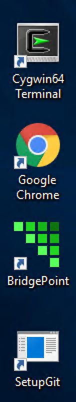

= Class Preparation Instructions

These instructions describe the steps to prepare for the 
xtUML training class.   

* <<Virtual Machine>>
  ** <<Log In>>
  ** <<Start BridgePoint>>
  ** <<Disconnect VM>>

== Virtual Machine 

=== Log In
The instructions to connect and log in here are the basic steps.  To set up
a shared folder from the local machine while logging in, link:connect_shared_folders.adoc[follow these instructions].  

* Launch __Remote Desktop Connection__   

image::img/Launching_Remote_Desktop.png[Launching Remote Desktop,height="703",width="401"]

* Enter one of the available IP Addresses: __13.231.101.27__   

image::img/rdc_IP_entry.png[IP entry,height="524",width="834"]

* Enter login info (user, password): student, Robots1   

image::img/rdc_user_login.png[User login,height="644",width="934"]

* Click "Yes" to the Certificate Warning dialog   
* Windows desktop is shown   

image::img/desktop.png[Desktop]

=== Start BridgePoint

* Start BridgePoint using the desktop shortcut   

* Test usability, play with the Welcome > Quick Start > Microwave Oven example  
* Exit BridgePoint  

=== Disconnect VM

* To exit the session, use Start > Power > Disconnect.  __Do not use Shut down__  

image::img/vm_disconnect.png[Disconnecting,height="492",width="696"]

== Congratulations!

You have completed your virtual machine class preparations.
