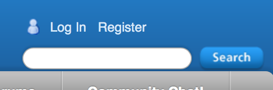

= Support Accounts Homework  image:../img/helpdesk.png[helpdesk]
include::../../include.adoc[]

== Issue Tracker Account
Create an account on https://support.onefact.net[support.onefact.net].  

image::../img/register1f.png[Register]

To do this, click on 'Register' when you visit the site page.  Fill out the
following form and `Submit` it.

NOTE:  Your new account request requires action from an engineer at One Fact.
It may take up to 1 full day for the work to be completed to set up your account.
You will receive a notice by email when your account is ready to use.

Navigate to https://support.onefact.net/issues/{hwtrackingissue}[issue {hwtrackingissue}] and follow the instructions.

== xtUML.org Account
Create an account on https://xtuml.org[xtuml.org].  

To do this, click on 'Register' when visit this site.  Fill out the form
you see and click the next `Register` button.

== Community Chat
Visit the https://hangouts.google.com/group/vMohZ9oW08xR7wSd2[xtUML Community chat Hangout]

Say 'hello' (or konichiwa) in this chat page.

== Submit Assignment
Email your instructor with the following information:  

* user ID for support.onefact.net
* user ID for xtuml.org
* email address used for the Hangout
* Please explain any difficulty you may have.

link:homework{outfilesuffix}[back to homework list]
