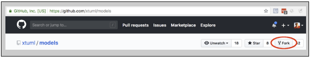

= GitHub Homework  
include::../../include.adoc[]

== Account Creation
Create an account on [github.com](https://github.com)  
(If you already have an account on github.com, you may use it.)  

* Fork https://github.com/xtuml/models[xtuml/models] repository.
  ** Click the button highlighted in red below:
     

== Logging In to GitHub
Open https://github.com/&lt;your_username&gt;/models

* Replace "&lt;your_username&gt;" in the above URL with your GitHub.com username
* Take a screenshot of this web page

== Development Workspace
Prepare your development workspace.

* Clone your fork of the `models` repositories to your local machine.  
([video tutorial](https://youtu.be/jkMbvtbbCLA)).

== Importing Projects
Import Sumo projects from your local models repository.  
(https://youtu.be/a0AD57W-jOk[video tutorial])  

* Import the `Sumo`, `Sumo Simulator`, and `MCLMShared` projects from the models repository.
* Take a screenshot of your BridgePoint application with the Sumo project imported.

== Screenshots
Attach both screenshots to your issue in Redmine.
In the Notes section, explain any difficulty you had completing the assignment.
Change the Status to 'Feedback' and Assignee to your instructor.

link:./[back to homework list]
