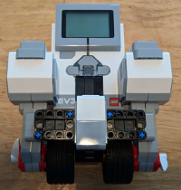

# Build the Balancer Robot Homework 

1) Build the EV3 LEGO balancer robot following [these instructions](../../balancer/).

 

2) Take a selfie of you holding your robot.
Attach the phote to your issue in Redmine.
In the Notes section, explain any difficulty you had completing the assignment.
Change the Status to 'Feedback' and Assignee to your instructor.

 
 
 
[Back to homework list](../homework)  
