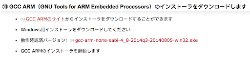

# Set up EV3RT Dev Environment Homework 

1) (pre-requisite) Build the EV3 LEGO sumo robot following [these instructions](../../sumo/).  

 

2) Set up your EV3RT development workspace following 
[this guide](http://ev3rt-git.github.io/get_started/). Run the sample program.   
  * **Note 1:** In "Step 0: Check your environment" you will need to follow the 
  instructions to install Cygwin on Windows.  In step 10 of those instructions, 
  do not download gcc-arm version 2014q3. Instead navigate to the GCC ARM page 
  and download the version containing string "2016q3".  It is newer and better.  

  

  * **Note 2:** In "Step 2: Prepare the configurator", simply download the pre-built
  binaries rather than compiling from the sources.  
 

3) Attach your compiled sample program to your issue in Redmine.
In the Notes section, explain any difficulty you had completing the assignment.
Change the Status to 'Feedback' and Assignee to your instructor.
 
 
 
[Back to homework list](../homework)  
