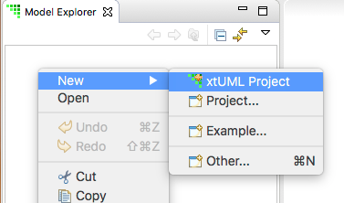
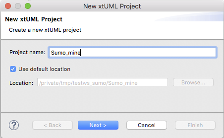
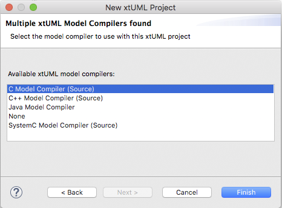
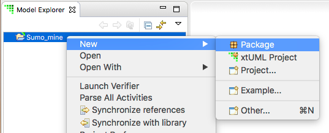
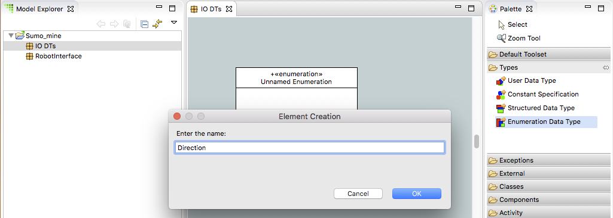
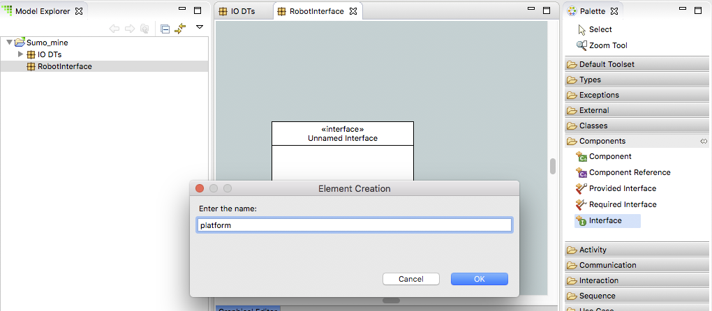
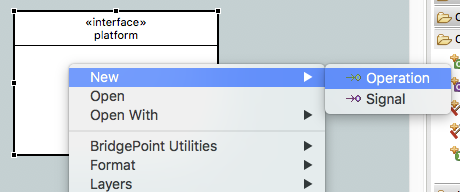
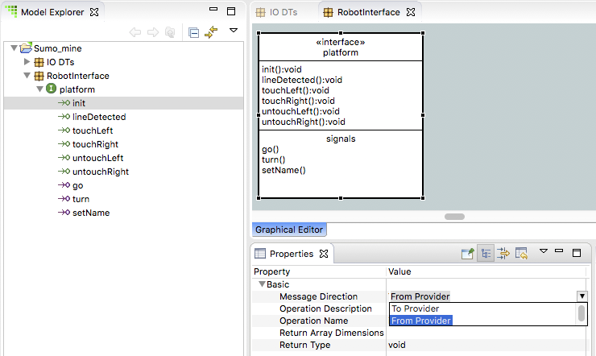
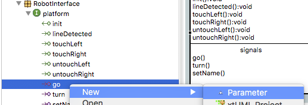
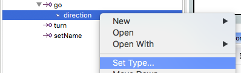

# Build a Sumo Model - Homework 1    

In this series of homeworks you will learn how to create a model using
BridgePoint.  We will walk though the model creation process step-by-step. These
instructions assume you have already installed BridgePoint and launched it.  

1) Create a new xtUML Project named *Sumo_mine*   
  

  

  

2) Right-click on *Sumo_mine* in Model Explorer view and select **New > Package**. Name the package *IO DTs*   
  

3) Create package *RobotInterface* under *Sumo_mine*    

4) Double-click package *IO DTs* to open it   

5) Create Enumeration DataType *Direction* inside *IO DTs* package   
  

6) Right-click on the *Direction* enumeration and select **New > Enumerator**. Name the enumerator *backward*   
  

7) Create Enumerator *stop* inside *Direction*   

8) Create Enumerator *forward* inside *Direction*   

9) Create Enumeration DataType *Orientation* inside *IO DTs* package   

10) Create Enumerator *left* inside *Orientation*   

11) Create Enumerator *straight* inside *Orientation*   

12) Create Enumerator *right* inside *Orientation*   

13) Double-click package *RobotInterface* in the Model Explorer view to open it  

14) Create interface *platform* inside *RobotInterface*   
  

15) Use the right-click context menu to Add the following operations and 
signals to *platform*   
  * operation: *init*  
  * operation: *lineDetected*  
  * operation: *touchLeft*  
  * operation: *touchRight*  
  * operation: *untouchLeft*  
  * operation: *untouchRight*  
  * signal: *go*  
  * signal: *turn*  
  * signal: *setName*  
  

16) In Model Explorer view, expand *Sumo_mine > RobotInterface > platform*.  All 
the interface messages are shown.  

17) Select *init*, then use the Properties view to modify the "Message Direction" 
property to be "From Provider". Repeat this process for each operation (do not change 
the signals).    
  

18) Right-click on *go* and select **New > Parameter**. Name the parameter *direction*.  
  

19) Expand the *go* interface message.  The *direction* parameter is shown.  

20) Right-click on the *direction* parameter and select **Set Type...**.  Use the wizard to select the *Direction* type.  
   

  

21) Right-click on *turn* and select **New > Parameter**. Name the parameter 
*orientation*.  

22) Expand the *turn* interface message.  The *orientation* parameter is shown.  

23) Right-click on the *orientation* parameter and select **Set Type...**.  Use the 
wizard to select the *Orientation* type.  

24) Right-click on *setName* and select **New > Parameter**. Name the parameter *name*.  

25) Expand the *setName* interface message.  The *name* parameter is shown.  

26) Right-click on the *name* parameter and select **Set Type...**.  Use the wizard 
to select the *string* type.  

 

### Submitting your homework

* Take a screenshot of your BridgePoint with Model Explorer view expanded to show 
all the elements you have created.  
* Open the BridgePoint support issue **you** created in [homework 1.1](1.1.html). Issue 
10472 is just used here as an example.  
* Edit the issue, scroll down to the Edit field:  
  * Change the Status to "Feedback"  
  * Change the Assignee to "cstarrett"  
  * Add a Note that this homework is completed 
  * Use the Choose Files button to attach your screenshot  
* Click the Submit button  

   

  

   

  

   

  

  

 

You are now ready to proceed to the [next step](./sumo_create2.html)

 
 
[Back to homework list](../homework)  
