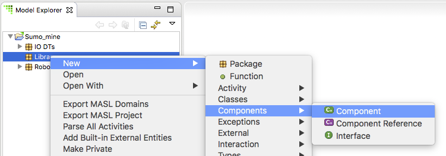
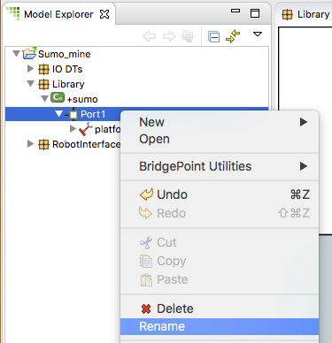

# Build a Sumo Model - Homework 2    

1) Create package *Library* under *Sumo_mine*   

2) Create component *sumo* under *Library*    
  

3) Double-click package *Library* to open it on the canvas    

4) Open the Components drawer in the Palette.  Select Required Interface. Draw 
the required interface extending out of the *sumo* component.
  

5) Right-click on the newly created required interface and select **Formalize...**  

6) Use the wizard dialog to select the *platform* interface inside this project  

7) Inside the Model Explorer view, expand *Sumo_mine > Library > sumo*.  *Port1* is 
visible.  

8) Expand *Port1*, *platform* is visible.  

9) Right-click on *Port1* and select **Rename**.  Enter the new name *IO*  
  

 

### Submitting your homework
* Take a screenshot of your BridgePoint with Model Explorer view expanded to show all the 
elements you have just created and edited.  
* Open the BridgePoint support issue you created in [homework 1.1](1.1.html). 
* Edit the issue, scroll down and add a Note that this homework is completed and use the
Choose Files button to attach your screenshot.  
* Click the Submit button  

 

You are now ready to proceed to the [next step](./sumo_create3.html)

 
 
[Back to homework list](../homework)  
