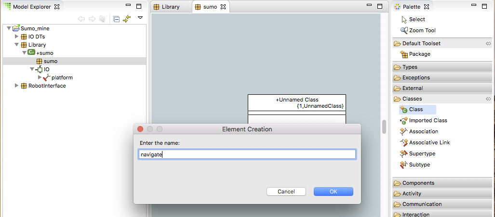
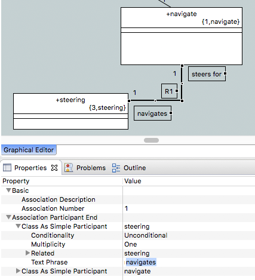

= Assignment 3
include::../../include.adoc[]

== Build a Sumo Model image:../img/sumo_robot.jpg[robot]

1. Create package *sumo* under component *sumo*

2. Double-click package *sumo* to open it on the canvas

3. Use the **Palette > Classes > Class** tool to create a class on the canvas.  Name it
 *navigate*
+

4. Create class *drive*

5. Create class *steering*

6. Click the **Association** tool in the Palette and drag between *navigate* and
*steering* on the canvas to draw an association

7. Click the **Association** tool in the Palette and drag between *navigate* and
*drive* on the canvas to draw an association

8. Select the association *R1* and then open the Properties view
  * Expand Association Participant End
  * Expand Class As Simple Participant for *steering*
  * Set the Text Phrase field to *navigates*
  * Expand Class As Simple Participant for *navigate*
  * Set the Text Phrase field to *steers for*
  * You can drag the phrases around on the canvas to reposition them and use the bendpoints
  on the association line to add turned segments to the line
+

9. Select the association *R2* and then open the Properties view
  * Expand Association Participant End
  * Expand Class As Simple Participant for *drive*
  * Set the Text Phrase field to *directs*
  * Expand Class As Simple Participant for *navigate*
  * Set the Text Phrase field to *motivates*

10. Right-click on *navigate* and select **New > Attribute**. Name the
attribute *retreat_duration*

11. Right-click on *navigate* and select **New > Attribute**. Name the
attribute *target_duration*

12. Right-click on *drive* and select **New > Attribute**. Name the
attribute *speed*

13. Right-click on *drive* and select **New > Operation**. Name the
operation *forward*

14. Right-click on *drive* and select **New > Operation**. Name the
operation *reverse*

15. Right-click on *drive* and select **New > Operation**. Name the
operation *stop*

== Submitting Your Assignment

* Take a screenshot of your BridgePoint with Model Explorer view expanded to show all the
elements you have just created.
* Open the BridgePoint support issue you created in link:../homework/1.1{outfilesuffix}[homework 1.1].
* Edit the issue, scroll down to the Edit field:
  ** Change the Status to "Feedback"
  ** Change the Assignee to "cstarrett"
  ** Add a Note that this assignment is completed
  ** Use the Choose Files button to attach your screenshot
* Click the Submit button

You are now ready to proceed to the link:sumo_create4{outfilesuffix}[next step]

link:sumo_edit{outfilesuffix}[back to assignment list]
