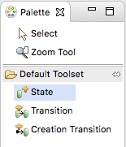

= Assignment 4
include::../../include.adoc[]

== Build a Sumo Model image:../img/sumo_robot.jpg[robot]

1. Right-click on *navigate* and select **New > Instance State Machine**.
+
image::../img/sumo_hw_4.1.png[]

2. Right-click on *steering* and select **New > Instance State Machine**.

3. Double-click on *navigate* to open its state machine canvas. Expand
*navigate* in Model Explorer view.

4. Use the **State** tool in the Palette to add the following states to the
state machine canvas:
+
* resting
* attacking
* retreating
* targeting
+

5. Next we will create events.  To create an event, right-click on a blank
area of the canvas and select **New > Event**.  Create the following events:

* pop
* line

6. Use the **Transtion** tool in the Palette to draw a transition from *resting*
to *attacking*.  Right-click on this transition and select **Assign Event...**. Use
the wizard to select *navigate1: pop*.

7. Add a transition from *attacking* to *retreating*.  Assign it to *navigate2: line*.

8. Add a transition from *retreating* to *targeting*.  Assign it to *navigat1: pop*.

9. Add a transition from *targeting* to *attacking*.  Assign it to *navigat1: pop*.

10. Double-click on *steering* class to open its state machine canvas. Expand
*steering* in Model Explorer view.

11. Use the **State** tool in the Palette to add the following states to the
state machine canvas:

* maintaining
* lefting
* righting

12. Next we will create events.  To create an event, right-click on a blank
area of the canvas and select **New > Event**.  Create the following events:

* left
* right
* straight

13. Use the **Transtion** tool in the Palette to draw a transition from *maintaining*
to *lefting*.  Right-click on this transition and select **Assign Event...**. Use
the wizard to select *steering1: left*.

14. Add a transition from *maintaining* to *righting*.  Assign it to *steering2: right*.

15. Add a transition from *righting* to *lefting*.  Assign it to *steering1: left*.

16. Add a transition from *lefting* to *righting*.  Assign it to *steering2: right*.

17. Add a transition from *lefting* to *maintaining*.  Assign it to *steering3: straight*.

18. Add a transition from *righting* to *maintaining*.  Assign it to *steering3: straight*.

== Submitting your assignment

* Take a screenshot of your *navigate* and *steering* state machines.
* Open the BridgePoint support issue you created in link:../homework/1.1.adoc[homework 1.1].
* Edit the issue, scroll down to the Edit field:
  ** Change the Status to "Feedback"
  ** Change the Assignee to "cstarrett"
  ** Add a Note that this assignment is completed
  ** Use the Choose Files button to attach your screenshots
* Click the Submit button

You are now ready to proceed to the link:sumo_create5.html[next step].

link:./[back to assignment list]
