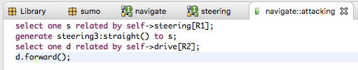

= Assignment 5
include::../../include.adoc[]

== Build a Sumo Model image:../img/sumo_robot.jpg[robot]

1. Double-click on *navigate* class to open its state machine canvas.

2. Double-click the *attacking* state to open its activity editor. Paste in
the following OAL or type it in by hand:
+
----
select one s related by self->steering[R1];
generate steering3:straight() to s;
select one d related by self->drive[R2];
d.forward();
----
Save and close this activity editor

3. Double-click the *retreating* state to open its activity editor. Paste in
the following OAL:
+
----
select one s related by self->steering[R1];
generate steering3:straight() to s;
select one d related by self->drive[R2];
d.reverse();
create event instance e of navigate1:pop() to self;
t = TIM::timer_start( microseconds:self.retreat_duration * 1000000, event_inst:e );
----
  * Save and close this activity editor

4. Double-click the *targeting* state to open its activity editor. Paste in
the following OAL:
+
----
select one d related by self->drive[R2];
d.stop();
select one s related by self->steering[R1];
generate steering1:left() to s;
create event instance e of navigate1:pop() to self;
t = TIM::timer_start( microseconds:self.target_duration * 1000000, event_inst:e );
----
  * Save and close this activity editor
  * Close this state machine canvas

5. Double-click on *steering* class to open its state machine canvas.

6. Double-click the *maintaining* state to open its activity editor. Paste in
the following OAL:
+
----
send IO::turn(orientation: Orientation::straight);
----
  * Save and close this activity editor

7. Double-click the *lefting* state to open its activity editor. Paste in
the following OAL:
+
----
send IO::turn(orientation: Orientation::left);
----
  * Save and close this activity editor

8. Double-click the *righting* state to open its activity editor. Paste in
the following OAL:
+
----
send IO::turn(orientation: Orientation::right);
----
  * Save and close this activity editor

== Submitting your assignment

* Take a screenshot of your *navigate* and *steering* state machines.
* Open the BridgePoint support issue you created in link:../homework/1.1.adoc[homework 1.1].
* Edit the issue, scroll down to the Edit field:
  ** Change the Status to "Feedback"
  ** Change the Assignee to "cstarrett"
  ** Add a Note that this assignment is completed
  ** Use the Choose Files button to attach your screenshots
* Click the Submit button

link:./[back to assigment list]
