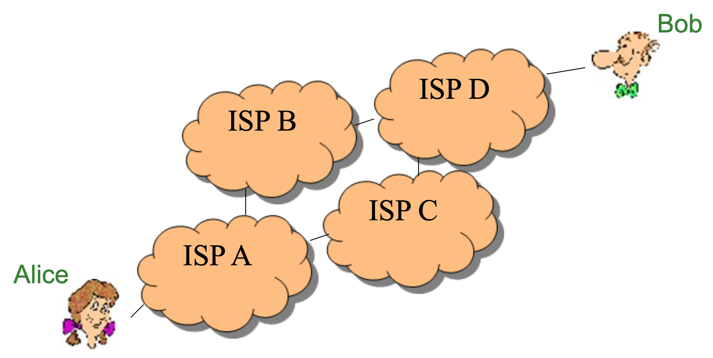
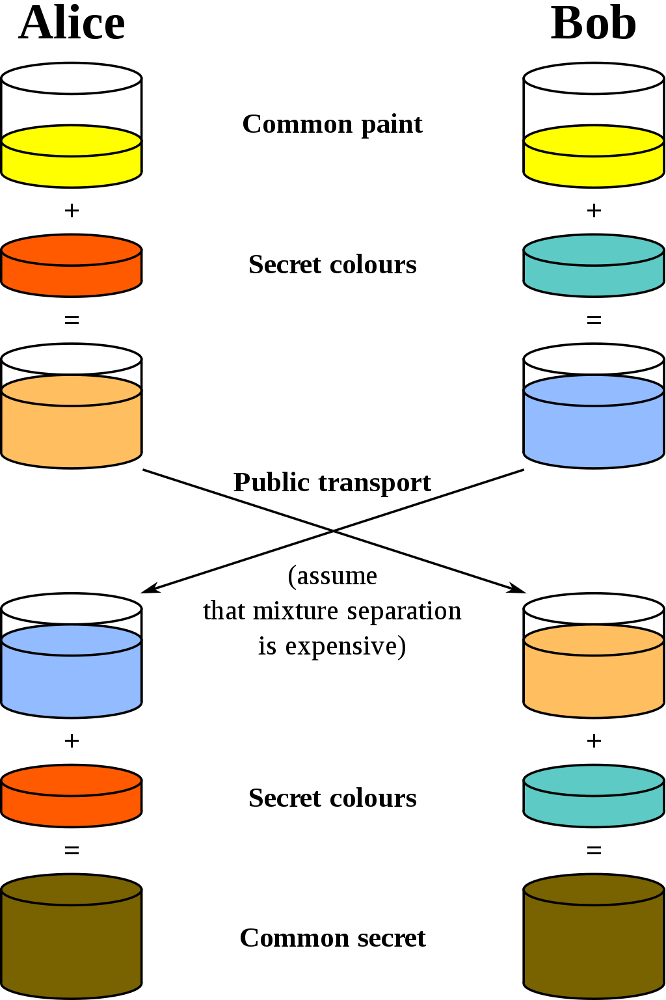
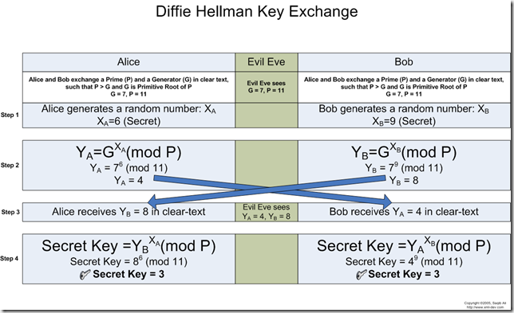
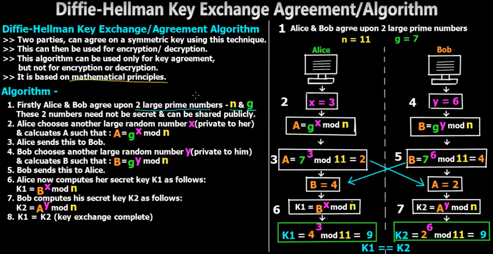

= Diffie-Hellman Key Exchange
include::../../include.adoc[]

== Problem

The "key exchange problem" is encountered when 2 parties ("Alice" and
"Bob") wish to communicate securely over an open, un-trusted network.
Each can encrypt a message, but how can the password be exchanged securely
without being physically together?  What if Alice and Bob live in different
countries?  What if Alice is an internet banking customer, and Bob is a bank?
Historically, passwords and secret keys were exchanged by courier, people
who would carry the password between the parties wishing to communicate.

Whitfield Diffie and Martin Hellman (and Ralph Merkle) devised a
mathematical solution to the key exchange problem.  Their method,
Diffie-Hellman (D-H) Key Exchange, enables 2 parties to establish
a shared secret (password) without the need to be physically in the
same location.

Read the https://en.wikipedia.org/wiki/Diffie%E2%80%93Hellman_key_exchange[Wikipedia page].

**How would _you_ solve the key exchange problem?**

== The Math

Let us practice some of the mathematics that are used in the D-H protocol.

The 'mod' operator performs division and then gives the remainder.
The 'mod' operator often is expressed with the '%' symbol.

 44 mod 6 =
 27 % 7 =
 8 mod 3 =
 100 % 10 =
 1000000 mod 10 =
 11 % 10 =
 1000001 mod 10 =
 31415927 % 7 =
 3 mod 2 =
 1234567890123456789 % 2 =

Solve each of the below equations for N or declare the solution "hard".

 2 ^ 3 mod 5 = N
 5 ^ 2 mod 13 = N
 2 ^ 17 mod 37 = N
 5 ^ 8 mod 97 = N
 5 ^ N mod 87 = 16
 3 ^ N mod 53 = 30
 7 ^ 8 mod 3891 = N

Perform a full Diffie-Hellman key exchange for the following two sets of starting points. Assume a base of g and modulus of p. Alice's private key is a; Bob's private key is b. Solve for Alice's public key, Bob's public key and the shared secret A, B and K respectively. (Show your work if you desire any partial credit.)

 g = 5, p = 19, a = 2, b = 5
 g = 2, p = 11, a = 7, b = 3

// (A=8, B=10, K=10)

 g = 2, p = 11, a = 3, b = 5

image::DHexample1.png[]
image::DHexample2.png[]

