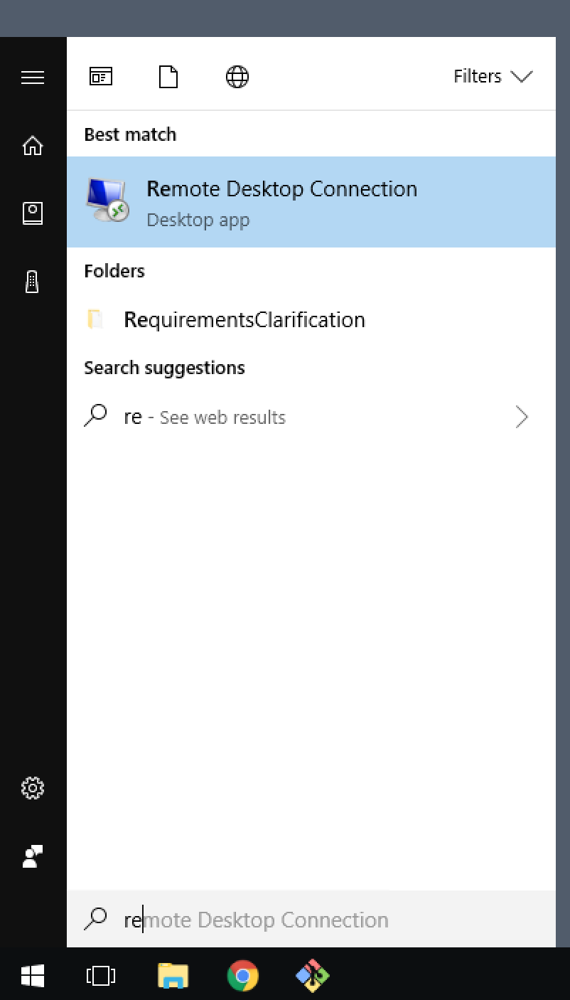
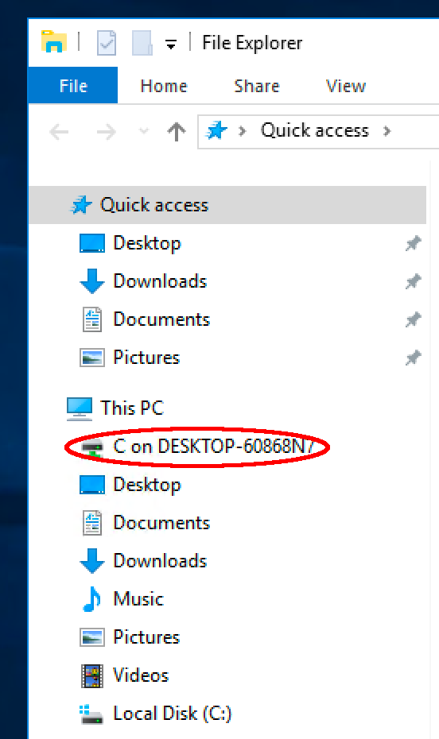

= Setting up Shared Folder During Login 
include::../../include.adoc[]

These instructions describe the steps to set up a shared folder 
while connecting to the VM and logging in.   

== Advanced Login Steps 

* Launch __Remote Desktop Connection__   

* Enter one of the available IP Addresses: __13.115.34.116__, __18.179.35.212__.  Click "Show Options"      

image::img/connect1.png[IP entry,height="530",width="836"]

* Click "Local Resources"   

image::img/connect2.png[Local Resources,height="976",width="840"]

* Click the "More..." button  

image::img/connect3.png[Local Resources,height="968",width="840"]

* Expand "Drives" and check the "C:" drive  

image::img/connect4.png[Local Resources,height="960",width="836"]

* Click "OK"
* Click "Connect"
* Enter login info (user, password): student, Robots1   

image::img/rdc_user_login.png[User login,height="644",width="934"]

* Click "Yes" to the Certificate Warning dialog   
* Windows desktop is shown   

image::img/desktop.png[Desktop]

* The local C drive is available in Explorer to transfer files   

link:../class_prep{outfilesuffix}[Return to Class Preparation Instructions]
