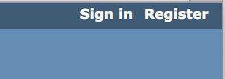

= Support Accounts Homework  
include::../../include.adoc[]

== トラッカ アカウントの発行
左記にトラッカのアカウントを作成する https://support.onefact.net[support.onefact.net].  

このサイトを訪れたら 'Register' をクリックし、
表示される欄に記入して次の`Submit` をクリック。

NOTE:  あなたのアカウント請求にブリッジポイント エンジニアリングチームが
アカウントの用意をしたうえで返信を出すまでには1両日必要です。
あなたのアカウントが利用可能になったらｅメールでお知らせします。

下記のＵＲＬをたどり、指示に従ってください。
https://support.onefact.net/issues/{hwtrackingissue}[issue {hwtrackingissue}]

== xtUML.org のアカウント発行
左記にxtUMLアカウントを作成する https://xtuml.org[xtuml.org].  

image::../img/registerxtumlorg.png[Register]

このサイトを訪れたら 'Register' をクリックし、
表示される欄に記入して次の`Register` をクリック。

== Community Chat
左記へ行く。 https://hangouts.google.com/group/vMohZ9oW08xR7wSd2[xtUML Community chat Hangout]

チャットページにて 'hello' または、”こんにちは”　と入力する。

== Submit Assignment
あなたの教師に下記の項目をｅメールしてください。 

* ユーザＩＤ for support.onefact.net
*ユーザＩＤ for xtuml.org
* ハングアウト用のｅメールアドレス
* 何か難しいことがあればここに記載

link:homework{outfilesuffix}[back to homework list]
