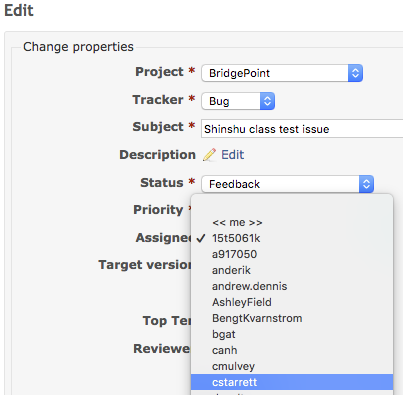

= BridgePoint 宿題  image:../img/xtuml_chip.png[xtUML chip]
include::../../include.adoc[]

== BridgePoint インストール作業
BridgePoint をインストールしなさい (https://s3.amazonaws.com/xtuml-releases/lego-build/buildfiles.html[LEGO Mindstorms build]).  

Note:  もしもここでインストールするBridgePointと別のバージョンの
BridgePointをインストールしていた場合は、そのバージョンのフォルダ名を変更してから、ここでのBridgePointを
インストールしなさい。

* https://s3.amazonaws.com/xtuml-releases/lego-build/org.xtuml.bp.product-win32.win32.x86_64.zip[Windows]
* https://s3.amazonaws.com/xtuml-releases/lego-build/org.xtuml.bp.product-linux.gtk.x86_64.zip[Linux]
* https://s3.amazonaws.com/xtuml-releases/lego-build/org.xtuml.bp.product-macosx.cocoa.x86_64.zip[macOS]

== クイック・スタート
BridgePointの始め方 _Quick Start_.
* BridgePointを実行する
* ウェルカムページの表示で先を選ぶ “Quick Start > Example Application - Microwave Oven”
  ** Use the Model Explorer tree view to navigate the model.
  ** Use the Palette and context menu to add new packages, types, classes, and associations.  Experiment! 

== フィアルをイシューに付与する
あなたのマシンでBridgePointが動作している画面コピーを取り
Redmine issue として添付しなさい。  ステータスを 'Feedback'　に変更し、
下記の指示を参考に作業者を教師に変更しなさい。

== Submitting your homework

* Take a screenshot on your PC with BridgePoint running.
* Open the BridgePoint support issue in Redmine that **you** created in link:1.1{outfilesuffix}[homework 1.1].
(Issue 10472 is used here only as an example.)
* Edit the issue; scroll down to the Edit field:
  ** Change the Status to "Feedback"
  ** Change the Assignee to "cstarrett"
  ** Add a Note that this homework is completed
  ** Use the Choose Files button to attach your screenshot
* Click the Submit button

image::../img/sumo_hw_1.13.png[screen]

image::../img/sumo_hw_1.13a.png[screen]

Write an appropriate message in the Note.  (This one is example text only.)

image::../img/sumo_hw_1.14.png[screen]

link:homework{outfilesuffix}[back to homework list]
