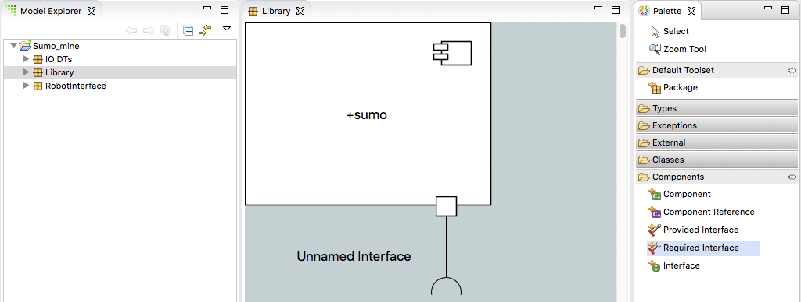

= Assignment 2
include::../../include.adoc[]

== Build a Sumo Model image:../img/sumo_robot.jpg[robot]

1. Create package *Library* under *Sumo_mine*

2. Create component *sumo* under *Library*
+
image::../img/sumo_hw_2.1.png[]

3. Double-click package *Library* to open it on the canvas

4. Open the Components drawer in the Palette.  Select Required Interface. Draw
the required interface extending out of the *sumo* component.
+

5. Right-click on the newly created required interface and select **Formalize...**

6. Use the wizard dialog to select the *platform* interface inside this project

7. Inside the Model Explorer view, expand *Sumo_mine > Library > sumo*.  *Port1* is
visible.

8. Expand *Port1*, *platform* is visible.

9. Right-click on *Port1* and select **Rename**.  Enter the new name *IO*
+
image::../img/sumo_hw_2.3.png[]

=== Assignment Submission

* Take a screenshot of your BridgePoint with Model Explorer view expanded
to show all the elements you have just created and edited.
* Open the BridgePoint support issue you created in link:../homework/1.1{outfilesuffix}[homework 1.1].
* Edit the issue, scroll down to the Edit field:
  ** Change the Status to "Feedback"
  ** Change the Assignee to "cstarrett"
  ** Add a Note that this assignment is completed
  ** Use the Choose Files button to attach your screenshot
* Click the Submit button

You are now ready to proceed to the link:sumo_create3{outfilesuffix}[next step]

link:sumo_edit{outfilesuffix}[back to assignment list]
